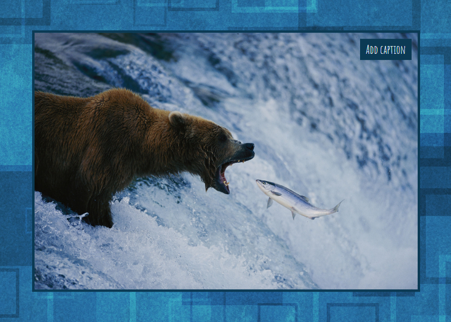

# jQueryCaption
Plugin which allows to dynamically add caption for image<br/><br/>
## How to use
### Include jQuery:
```javascript
<script src="https://ajax.googleapis.com/ajax/libs/jquery/1.9.1/jquery.min.js"></script>
```
### Include plugin's code:
```javascript
<script type="text/javascript" src="/path/to/js/jquery.caption.js"></script>
```
### Call the plugin:
You can use some String as a parameter in order to generate caption. If it is undefined, image's <b>alt</b> value is used for caption by default.
```javascript
$("#selector").addCaption("Mishka na severe");
```
<br/><br/>
View on <a href="http://www.gerayzade.me/dev/caption/" target="_blank">gerayzade.me</a>
